# InnerWork

## Autores y participación

* [Antonio Delgado Rodríguez](https://github.com/AntonioDR01): 25%
* [Manuel Dueñas Cortés](https://github.com/manuelduenascortes): 25%
* [Alejandro Gálvez Madueño](https://github.com/AGALMAD): 25%
* [Jesús Herrera Sánchez](https://github.com/Jesushs4): 25%

## Enlace

https://web.innerwork-ai.es/
[**InnerWork APK**](https://drive.google.com/file/d/1_D-iKTllqeR3UdAIsmd40k68DTk3V-46/view?usp=sharing)

## Introducción

**InnerWork** en un Trabajo de Fin de Máster consistente en una aplicación web y móvil de *Machine Learning*, enfocada en el análisis de la satisfacción laboral de los empleados. Los usuarios completan encuestas periódicas que recopilan datos sobre su bienestar y experiencia en el trabajo. A partir de estas respuestas, el sistema procesa la información y genera métricas e indicadores de satisfacción. Cada empleado puede acceder a un *dashboard* personal para visualizar su evolución a lo largo del tiempo. Por otro lado, los administradores de cada empresa disponen de un panel global donde pueden analizar el estado de satisfacción de todos sus empleados. El objetivo principal es ayudar a las empresas a detectar problemas laborales y mejorar el clima organizacional.

La idea surge de la necesidad de mejorar el ambiente laboral y poder evitar tanto el *burnout* como el malestar a la hora de trabajar, de forma que se puedan detectar patrones y poder tomar medidas al respecto.

## Justificación y descripción del proyecto

### Justificación

En la actualidad, el bienestar emocional y la satisfacción de los empleados se han convertido en pilares fundamentales para la retención del talento y la productividad en el entorno empresarial. El burnout y el deterioro del clima laboral no solo afectan la salud de los trabajadores, sino que impactan directamente en los resultados de las empresas.

Este proyecto, **InnerWork** nace de la necesidad de transformar la gestión de recursos humanos reactiva en una estrategia proactiva y basada en datos. A menudo, las empresas detectan los problemas cuando el empleado ya ha decidido dimitir; nuestra solución busca identificar patrones de malestar de forma temprana para permitir intervenciones antes de que sea demasiado tarde.

### Descripción de la Solución

La propuesta consiste en una plataforma (tanto web y móvil) que utiliza *Machine Learning* para monitorizar y predecir el índice de satisfacción labora mediante las siguientes acciones:

* **Recopilación de datos**: Sistema de encuestas periódicas donde el empleado selecciona su satisfacción y su malestar respecto a su día a día en la empresa. Dichas encuestas también cuentan con un formulario abierto donde el empleado puede expresar libremente sus sentimientos. Por último, se pueden realizar una o varias fotos del empleado mientras hace la encuesta para analizar sus estado de ánimo.

* **Procesamiento inteligente**: Aplicación de modelos de *Machine Learning*, técnicas de Procesamiento de Lenguaje Natural (NLP) y análisis de imágenes para analizar tanto métricas cuantitativas como los sentimientos detrás de los comentarios abiertos y de las fotos.

* **Visualización**: Uno de los puntos fuertes de **InnerWork** es su capacidad para ofrecer una visualización fácil e intuitiva de los datos gracias a gráficas y al uso de colores , permitiendo que la información técnica se convierta en decisiones estratégicas de forma inmediata.

  * ***Dashboard* de empleado**: Espacio privado diseñado para el autoconocimiento. En él, el trabajador puede realizar un seguimiento de su propia evolución y bienestar a lo largo del tiempo, visualizando su historial de satisfacción de forma gráfica.

  * **Panel de administración**: Herramienta global orientada a los responsables de Recursos Humanos que muestra el nivel de satisfacción global de la empresa y el nivel de estrés.

### Objetivos del Proyecto

* **Objetivo General**: Desarrollar una aplicación capaz de diagnosticar el clima labora mediante el analisis de datos con inteligencia artificial.

* **Objetivos específicos**:

  * Entrenar un modelo de *Machine Learning* que clasifique el nivel de satisfacción y detecte posibles anomalías en el comportamiento laboral.

  * Entrenar un modelo que analice patrones lingüísticos en comunicaciones escritas para determminar el riesgo de *burnout*.

  * Entrenar un modelo de visión artificial que permita, mediante la captura y procesamiento de imágenes, identificar el estado de ánimo del empleado a través de sus expresiones faciales.

  * Implementar un flujo de extracción y limpieza de datos provenientes de encuestas de usuario.

  * Integrar técnicas de NLP para el análisis de sentimientos en respuestas abiertas.

  * Transcripción de audio para obtener el texto de lo dicho por el empleado para pasarlo a nuestro modelo NLP.

  * Implementar un chatbot con contexto de los empleados para poder ayudarles y recomendarles.

  * Implementar un agente que al recibir un nuevo formulario decida entre varias acciones, pudiendo generar e-mails con HTML y enviarlos a quien vea oportuno.

  * Utilizar un modelo preentrenado que detecta cuando se ve una cara en una imagen o vídeo.

  * Desplegar una aplicación web funcional e intuitiva que consuma los modelos entrenados y presente los indicadores de bienestar mediante *dashboards* dinámicos.

## Obtención de los datos

Para el desarrollo de este proyecto se han empleado tres conjuntos de datos diferenciados, cada uno destinado al entrenamiento y validación de los tres modelos específicos que integran la aplicación. La arquitectura de datos se divide según la naturaleza de la información procesada: métricas cuantitativas de insatisfacción, texto libre para análisis semántico y registros visuales para el reconocimiento de estados anímicos.

La elección de estos conjuntos de datos radica en su alta representatividad y solidez técnica. Cada *dataset* cuenta con un volumen de registros estadísticamente significativo, lo que permite el entrenamiento de modelos con una capacidad de generalización adecuada y reduce el riesgo de sobreajuste (*overfitting*).

### *Dataset* de insatisfacción laboral

Este conjunto de datos constituye la base lógica con la que se ha entrenado el modelo que evalúa la encuesta periódica que realizan los empleados en la plataforma.

El *dataset* utilizado ha sido [IBM HR Analytics Attrition & Performance](https://www.kaggle.com/datasets/pavansubhasht/ibm-hr-analytics-attrition-dataset), formado por datos sintéticos que han sido creados a partir de datos reales y que contiene 1.470 registros y 35 columnas.

Las variables de este *dataset* se utilizan como referencia para las preguntas del test de usuario. El modelo entrenado permite que, a partir de las respuestas, se cuantifique el riesgo de descontento del trabajador.

### *Dataset* de salud mental

Este conjunto de datos se utiliza para entrenar el motor de análisis de texto de InnerWork, encargado de procesar las respuestas abiertas de los empleados para detectar indicadores tempranos de fatiga psicológica.

El *dataset* utilizado ha sido [Mental Health Corpus](https://www.kaggle.com/datasets/reihanenamdari/mental-health-corpus/) que posee 27977 registros y solo dos columnas: el texto y si muestra salud mental en riesgo o no.

### *Dataset* de detección de estrés en imágenes faciales

Para la capa de análisis visual de **InnerWork**, se ha integrado un conjunto de datos especializado en la identificación de patrones fisiológicos de tensión en el rostro.

Para este modelo se ha usado el *dataset* [WorkStress3D Dataset](https://data.mendeley.com/datasets/t93xcwm75r/12) constituido por 30520 imágenes de caras en escala de grises etiquetadas como emoción positiva o emoción negativa. También incluye una tercera columna denominada Usage que predefine el propósito de cada imagen dentro del flujo de trabajo de la IA, siendo Training, PublicTest y PrivateTest las tres categorías en las que se divide.

## Limpieza, exploración y visualización de datos

En esta fase se transforman los datos brutos en estructuras aptas para el aprendizaje automático, asegurando la integridad y la capacidad predictiva de los modelos.

### Limpieza *dataset* de insatisfacción laboral

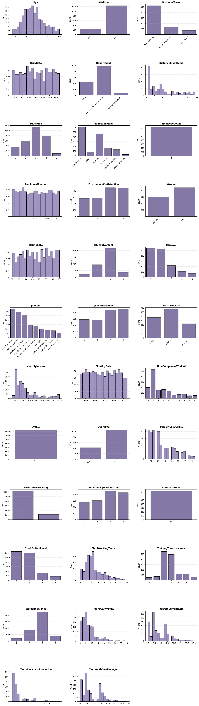

Tras una inspección inicial mediante histogramas y análisis de valores únicos, se han determinado las siguientes acciones de limpieza:

* **Eliminación de variables constantes**: Se han detectado columnas que presentan el mismo valor en todos los registros, lo que las hace nulas para la predicción. Se procede a la eliminación de: Over18, EmployeeCount y StandardHours.

* **Integridad de los datos**: Tras realizar una búsqueda de valores nulos, registros duplicados y errores tipográficos en las variables categóricas, se descubrió que los datos vienen muy bien presentados y no hay que realizar ninguna imputación.

* **Tratamiento del desbalanceo**: Se observa un marcado sesgo en la variable objetivo (*Attrition*). Para mitigar este efecto, se aplica una partición estratificada, garantizando que la proporción de las clases se mantenga idéntica tanto en el conjunto de entrenamiento como en el de test.

Para que el modelo pueda procesar la información, se han aplicado las siguientes técnicas de ingeniería de variables:

* **Codificación Binaria**: Aplicada a las columnas Gender, Attrition y OverTime para transformar el texto en valores numéricos (0/1).

* **Codificación Ordinal**: Utilizada en variables con una jerarquía lógica clara (por ejemplo, en la columna BusinessTravel).

* **One-Hot Encoding**: Aplicado al resto de variables categóricas sin orden predefinido para evitar sesgos jerárquicos artificiales.

Mediante la visualización de las correlaciones, se identifican las variables que presentan una mayor relación estadística con la rotación laboral (*Attrition*). Este análisis es vital para entender qué factores pesan más en el malestar del empleado.

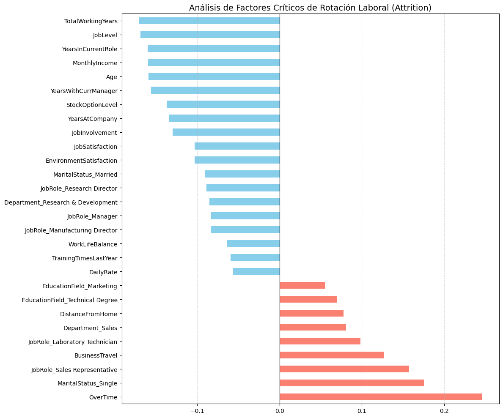

Para optimizar el rendimiento del modelo y reducir el ruido estadístico, se ha aplicado un criterio de filtrado por relevancia mediante un umbral de corte en el que se eliminan todas aquellas variables cuya correlación con la variable objetivo sea inferior a 0,05 en valor absoluto. Este umbral permite conservar únicamente los factores con un impacto estadístico significativo, simplificando la complejidad del modelo sin perder capacidad predictiva para la aplicación final y ayudando a prevenir el sobreajuste (*overfitting*) al descartar variables que podrían introducir patrones aleatorios en la aplicación final.

### Limpieza *dataset* de salud mental

A diferencia de otros conjuntos de datos de texto, el Mental Health Corpus presenta una integridad del 100%, sin valores nulos en ninguna de sus columnas, lo que permite proceder directamente al análisis exploratorio.

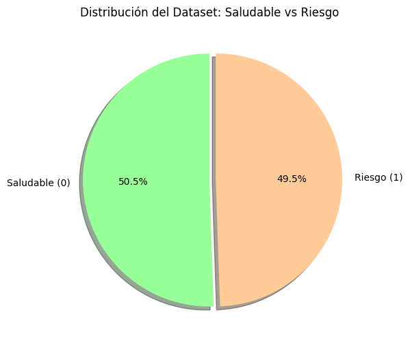

Como se observa en la gráfica superior, las proporciones entre las categorías son prácticamente simétricas. Esta distribución equitativa constituye una ventaja crítica para el entrenamiento, ya que:

* Evita el sesgo hacia la clase mayoritaria.

* Permite que el algoritmo identifique patrones de ambos estados con la misma eficacia.

* Valida el uso de la precisión (*accuracy*) como métrica de rendimiento fiable.

Durante la exploración de los textos, se ha detectado que los mensajes asociados a individuos con indicadores de riesgo tienden a ser significativamente más extensos que los del grupo saludable.

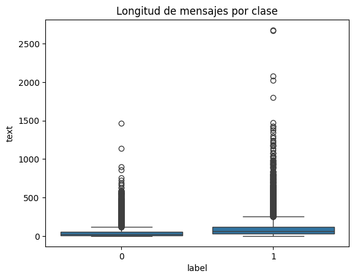

Este hallazgo revela un riesgo de sesgo por longitud: el modelo podría aprender erróneamente a asociar la cantidad de palabras con la presencia de un problema de salud mental, ignorando el contenido semántico real. Para mitigar este riesgo, en la fase de preprocesamiento se pondrá especial énfasis en la normalización del texto para asegurar que la clasificación se base en el significado y el sentimiento del mensaje, y no en su extensión.

### Limpieza *dataset* de detección de estrés en imágenes faciales

Antes de proceder con el modelado, se ha analizado la distribución de la variable objetivo (emotion) para validar la calidad estadística del dataset.

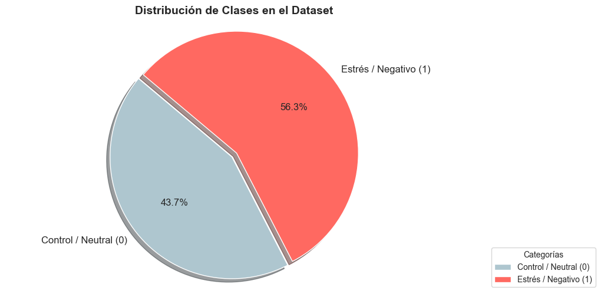

Como se evidencia en la gráfica, el dataset presenta una distribución cercana a la paridad, por lo que se considera técnicamente balanceado, lo que conlleva tres implicaciones metodológicas:

* **Validación de Métricas**: Permite utilizar la exactitud (*accuracy*) como indicador principal de rendimiento sin sesgos estadísticos.

* **Simplificación del *Pipeline***: Se descarta la necesidad de aplicar técnicas de re-muestreo sintético (como SMOTE) o ajustes de pesos en la función de pérdida.

* **Representatividad**: La ligera prevalencia de la clase "Estrés" asegura abundantes ejemplos positivos, minimizando el riesgo de falsos negativos en la detección.

El *dataset* incluye la variable Usage, que predefine el propósito de cada muestra siguiendo la estructura estándar de competiciones científicas.

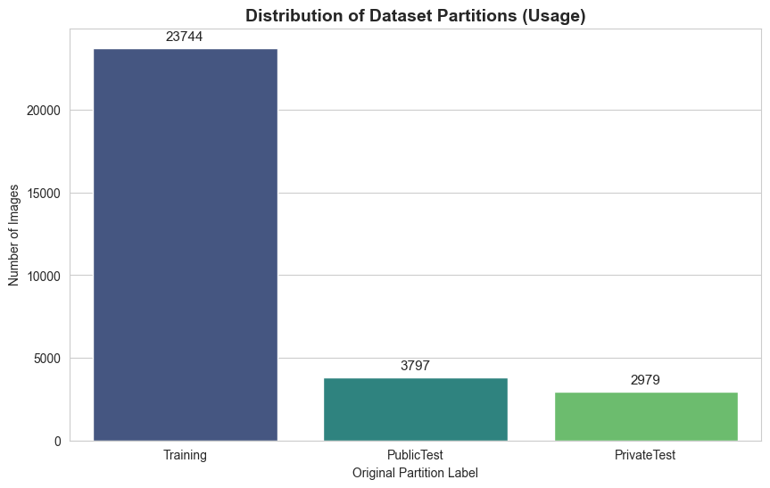

Respetar esta nomenclatura es fundamental para la trazabilidad y comparativa del experimento:

* **Training**: Subconjunto mayoritario para el ajuste de pesos de la red neuronal.

* **PublicTest**: Utilizado como conjunto de Validación para monitorizar la pérdida y evitar el sobreajuste (*overfitting*).

* **PrivateTest**: Actuará como conjunto de prueba (test), manteniéndose aislado hasta la evaluación final.

## Preparación de los datos para los algoritmos de *Machine Learning*

### Preparación del modelo de insatisfacción laboral

Una vez seleccionadas las variables más influyentes, se procede a preparar el conjunto de datos para el entrenamiento del modelo.

Este proceso se divide en dos pasos:

* Escalado de Características (StandardScaler): Dado que el dataset contiene variables con rangos muy distintos (como la Edad frente al Sueldo Mensual), aplicamos una estandarización para que todas tengan la misma escala. Esto evita que el modelo otorgue una importancia injustificada a las variables con números más grandes y mejora la velocidad de convergencia del algoritmo.

### Preparación del modelo de salud mental

La preparación de los datos textuales es un proceso crítico que transforma el lenguaje humano en una representación numérica procesable para la máquina. Este flujo de trabajo se divide en dos fases principales:

* **Normalización del texto (Limpieza con Regex)**: Se aplica una limpieza profunda para eliminar el "ruido" que no aporta valor semántico al modelo:

  * **Estandarización**: Conversión de todo el texto a minúsculas y eliminación de espacios en blanco innecesarios.

  * **Filtrado de elementos web**: Eliminación automática de URLs, enlaces y protocolos.

  * **Limpieza de redes sociales**: Borrado de menciones de usuarios (@) y etiquetas (*hashtags*).

  * **Eliminación de caracteres especiales**: Supresión de signos de puntuación y símbolos mediante expresiones regulares para centrar el análisis solo en el contenido léxico.

* **Vectorización mediante TF-IDF**: Se utiliza la técnica Term Frequency-Inverse Document Frequency para asignar un peso estadístico a cada palabra según su relevancia. La configuración incluye:

  * **Rango de N-gramas**: Inclusión de unigramas y bigramas (parejas de palabras) para capturar mejor el contexto y las negaciones.

  * **Límites de frecuencia**: Se ignoran términos extremadamente raros (que aparecen en menos de 3 documentos) o excesivamente comunes (más del 90%), optimizando el rendimiento.

  * **Selección de características**: Extracción de las 5 000 palabras/frases con mayor peso estadístico.

  * **Eliminación de *stop words***: Filtrado de palabras de relleno (como "the", "is", "at") que no definen el sentimiento del mensaje.

* **Mitigación del sesgo de longitud**: Se han implementado dos ajustes técnicos fundamentales para evitar que los textos largos se clasifiquen erróneamente como de riesgo:

  * **Normalización L2**: Ajusta los vectores de tal forma que los documentos cortos y extensos sean matemáticamente comparables.

  * **Frecuencia de término sublineal**: Aplica una escala logarítmica para reducir el peso de las palabras que se repiten excesivamente en un solo texto, asegurando que la predicción se base en la carga emocional y no en la cantidad de palabras.

* División del Dataset (Train/Test Split): Dividimos los datos en un conjunto de entrenamiento (80%) y uno de prueba (20%). Se utiliza el parámetro stratify=y para garantizar que la proporción de empleados que se van y los que se quedan sea la misma en ambos grupos, asegurando que el modelo aprenda a identificar correctamente ambas situaciones.

## Entrenamiento y comprobación del rendimiento de los modelos

### Entrenamiento del modelo de insatisfacción laboral y comprobación de su rendimiento

Para identificar el riesgo de de fuga de talento, se han comparado tres de los algoritmos más robustos en aprendizaje supervisado sobre datos tabulares: **Logistic Regression**, **Random Forest Classifier** y **XGBoost Classifier**.

Tras comparar todos los resultados de los entrenamientos, se sacan las siguientes conclusiones de cada uno:

* **Logistic Regression**: Predice más empleados que se van y en realidad se quedan, pero tiene un ligero mejor rendimiento en acertar los que se van a ir realmente. Este modelo es útil en el caso de que se priorice detectar más empleados que se van a cambio de obtener más falsos positivos.

  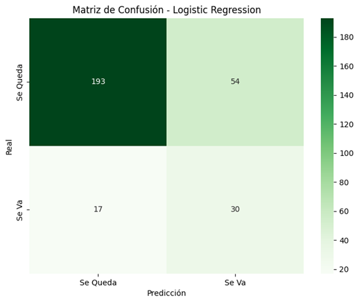

* **Random Forest Classifier**: Es el peor de los tres modelos con un rendimiento bastante malo, dando un *recall* de 0,11 en la segunda clase y acertando muy pocos casos, por lo que queda descartado.

  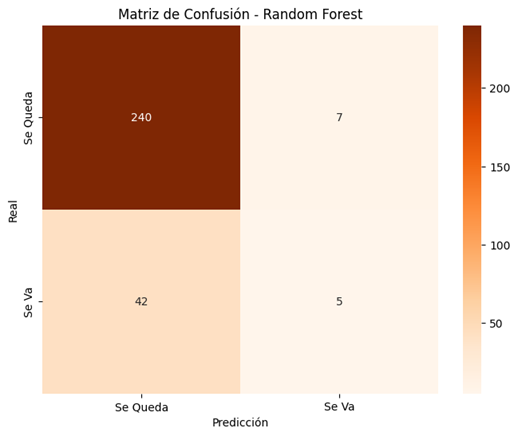

* **XGBoost Classifier**: Es el que está más balanceado de todos y ofrece un mejor rendimiento general. Acierta 21 casos de gente que se va y realmente se va a ir, y tiene 26 falsos positivos y falsos negativos. Ofrece una precisión bastante buena para la clase 0 (0,89) y para la clase 1 un (0,45), que no es perfecta pero puede servir teniendo en cuenta el propósito de la aplicación.

  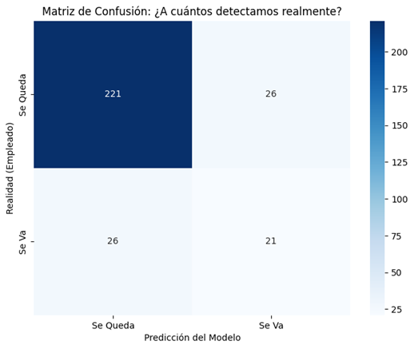

Se ha seleccionado **XGBoost** como el motor predictivo final. El criterio de elección se basa en su capacidad para minimizar el exceso de falsos positivos en comparación con Logistic Regression, ofreciendo una fiabilidad superior para la toma de decisiones corporativas.

### Entrenamiento del modelo de salud mental y comprobación de su rendimiento

Para la detección de indicadores de burnout y estrés en el lenguaje, se han evaluado tres arquitecturas tras el proceso de vectorización TF-IDF: **Logistic Regression**, **Random Forest** y **LinearSVC**.

Tras someter a los modelos a los datos de prueba, se observó una competencia muy reñida entre los modelos lineales, destacando sobre el enfoque de árboles de decisión:

* **Logistic Regression**: Logró la mayor precisión del conjunto con un 91,96%. Su capacidad para asignar probabilidades continuas lo hace ideal para detectar matices en el lenguaje.

  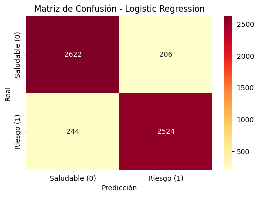

* **LinearSVC**: Obtuvo un rendimiento casi idéntico del 91,80%. Es un modelo extremadamente robusto para espacios de alta dimensionalidad (como los 5.000 términos de nuestro vocabulario).

  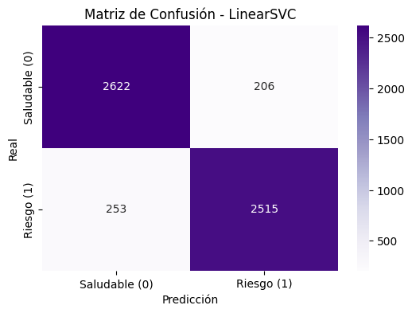

* **Random Forest**: Presentó un desempeño inferior en comparación con los anteriores, confirmando que, en tareas de clasificación de texto con TF-IDF, los modelos lineales suelen generalizar mejor los patrones semánticos.

  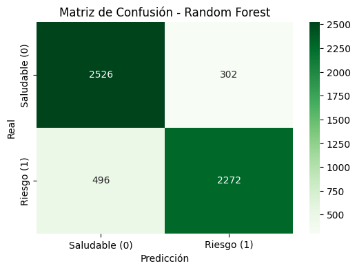

Para garantizar que el sistema es útil en un entorno real, se realizó una prueba de "estrés" introduciendo una batería de ajenos al dataset, que simulaban tanto estados de bienestar como crisis de agotamiento laboral.

| Modelo | Precisión en Textos Externos | Observaciones |
| :--- | :--- | :--- |
| **LinearSVC** | 80% | Sólido, pero presenta dificultades en textos con indicadores mixtos. |
| **Logistic Regression** | 90% | Excelente capacidad de calibración y detección de casos límite. |

Los resultados demuestran que Logistic Regression no solo es más precisa estadísticamente, sino que posee una sensibilidad superior para interpretar la carga emocional de frases ambiguas. El modelo asigna probabilidades de riesgo coherentes, lo que permite identificar señales tempranas incluso cuando el lenguaje no es explícitamente alarmante.

La integración de este modelo en la aplicación permitirá identificar patrones y predecir de manera temprana problemas laborales entre los empleados, ofreciendo un recurso valioso para la gestión del bienestar y la prevención del estrés o burnout mediante una salida probabilística en la interfaz de **InnerWork**.

### Entrenamiento del modelo de detección de estrés en imágenes faciales y comprobación de su rendimiento

En esta sección se detalla la configuración, el proceso de aprendizaje y la evaluación de la Red Neuronal Convolucional (CNN) diseñada para la clasificación del estrés a partir de rasgos faciales.

La arquitectura se ha diseñado para extraer características jerárquicas de forma automática, estructurándose en las siguientes capas:

* **Capas Conv2D + ReLU:** Actúan como filtros jerárquicos. Las primeras capas detectan bordes y texturas, mientras que las más profundas identifican rasgos faciales complejos asociados al estrés.

* **MaxPooling2D:** Estas capas condensan la información espacial, permitiendo que el modelo sea robusto ante pequeñas variaciones o desplazamientos en la posición del rostro.

* **GlobalAveragePooling2D, Dense y Dropout:** El uso de **Dropout** es vital para prevenir el sobreajuste (*overfitting*), obligando a la red a no depender de neuronas específicas. La capa **Dense** final actúa como el clasificador lógico que dictamina la probabilidad de la categoría detectada.

Para el proceso de aprendizaje de la red, se ha definido una metodología basada en la optimización de recursos y la estabilidad del modelo:

* **Épocas (Epochs):** Se ha establecido un límite de 100 ciclos de entrenamiento completos sobre el conjunto de datos.

* **Tamaño de Lote (Batch Size):** Se procesan las imágenes en bloques de 32 para optimizar el uso de la memoria y estabilizar la actualización de los pesos.

* **Validación Cruzada:** El modelo se evalúa simultáneamente con el conjunto de pruebas, permitiendo monitorizar la capacidad de generalización en tiempo real.

Las curvas de aprendizaje permiten diagnosticar el comportamiento del modelo a lo largo de las 100 épocas. Se analizan dos métricas críticas: la **Exactitud (Accuracy)** y la **Pérdida (Loss)**.

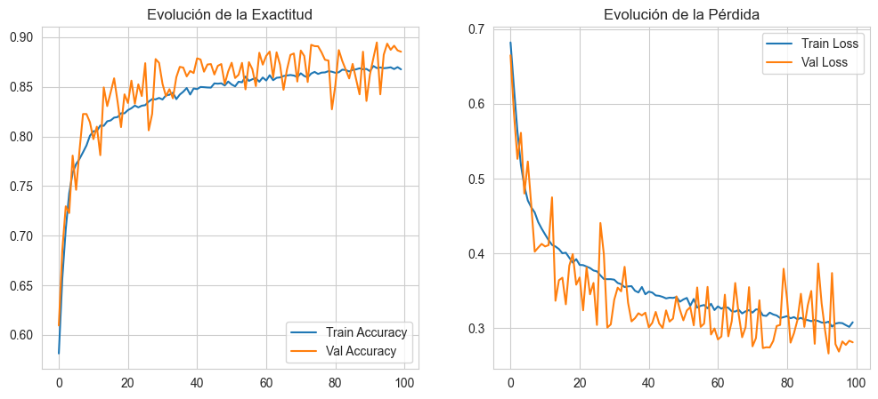

* **Evolución de la Exactitud:** Ambas curvas (entrenamiento y validación) ascienden rápidamente durante las primeras 20 épocas y convergen en torno al 86-88%. La convergencia de ambas líneas indica que el modelo ha aprendido patrones consistentes.

* **Evolución de la Pérdida:** La pérdida de entrenamiento desciende de forma constante hasta estabilizarse cerca de 0,3, lo que significa que el error del modelo disminuye progresivamente. La pérdida de validación también desciende y se mantiene en un rango similar. Aunque presenta oscilaciones más marcadas (ruido de validación) a lo largo del entrenamiento, no se observa una tendencia al alza, lo que confirma que se ha evitado con éxito el sobreajuste (*overfitting*).

La matriz de confusión permite identificar cómo se distribuyen los aciertos y errores del clasificador binario en el conjunto de prueba independiente.

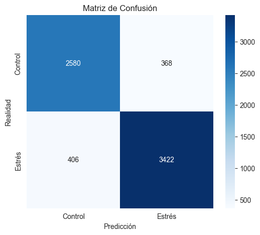

| Métrica | Valor (Clase Estrés) | Interpretación |
| :--- | :--- | :--- |
| **Exactitud (Accuracy)** | 0,89 | Capacidad global de acierto del modelo. |
| **Sensibilidad (Recall)** | 0,89 | Capacidad para detectar casos reales de estrés. |
| **F1-Score** | 0,90 | Equilibrio óptimo entre precisión y sensibilidad. |

El desglose de los resultados revela un desempeño sólido:

* **Verdaderos Positivos (Estrés):** Se identifican correctamente el 89% de los individuos estresados.

* **Falsos Positivos:** Se registraron 368 casos de control clasificados erróneamente como estrés, un margen de precaución aceptable en un escenario preventivo.

* **Falsos Negativos:** Se registraron 406 casos donde el estrés no fue detectado, marcando el área principal de mejora para futuras iteraciones.

Para verificar la utilidad práctica de **InnerWork**, se realizó una prueba de inferencia con imágenes ajenas al dataset original. El flujo de procesamiento (escala de grises, redimensionado a 48x48 y normalización) permitió obtener predicciones coherentes ante nuevas caras, iluminaciones y posturas.

Conclusiones de la implementación:
* **Resiliencia:** La arquitectura CNN y el uso de *Data Augmentation* lograron un modelo robusto con un 89% de precisión global.

* **Prevención:** Un *Recall* del 0,89 en la clase crítica asegura intervenciones a tiempo en la inmensa mayoría de los casos de riesgo de *burnout*.

## Aplicación web

### Landing Page

### Registro
* Registro para crear empresa

### Login
* Login para acceder tanto como admin como empleado

### Reiniciar contraseña / Verificar cuenta
* Página accesible mediante correo de reestablecer contraseña, funcional mediante token en la URL.

### Dashboard de empleados
* Gráfica enseñando el historial de satisfacción y de estrés del empleado
* Alerta de si hay un *check-in* pendiente
* Chatbot mediante la API de Groq, especializado en estrés laboral y *burnout*, con contexto del último formulario del empleado para poder ayudarle.

### Check-in
* Prueba de vídeo y audio donde se obtendran imágenes y audio durante mínimo 15 segundos para analizar estrés mediante IA.
* Formulario breve donde el empleado describe como le ha ido su semana laboral para analizarlo junto a sus datos de empleado mediante IA.

### Dashboard de admin
* Modal para crear empleado
* Tarjetas representando el estado de la empresa (Porcentaje de *burnout* general, alertas críticas y porcentaje de formularios realizados)
* Lista de empleados con su respectivo porcentaje de *burnout*
* Gráfica enseñando el historial de satisfacción y estrés de la empresa

### Lista de empleados
* Filtro para buscar empleados por nombre, nivel de *burnout*, departamento y por fecha del último formulario.
* Editar datos de empleados
* Borrar empleados

# Conclusión

**InnerWork** ha supuesto un desarrollo difícil pero valioso, donde hemos podido aprender mucho tanto de IA como de trabajo en equipo, organizándonos lo mejor posible para conseguir el mejor producto.

Al haber integrado tres modelos entrenados por nosotros en un aplicación con una interfaz amigable e intuitiva que también hace uso de varios modelos externos, consideramos que hemos logrado nuestros objetivos al conseguir proyecto útil y que podría servir para un entorno real.

## Tecnologías utilizadas

### Frontend
* Ionic
* Angular
* Tailwind CSS
* Capacitor
* Leaflet + LocationIQ API

### Backend & AI
* FastAPI
* SQLAlchemy
* PostgreSQL
* Docker
* Scheduler
* FastAPI Mail

### AI
* TensorFlow + scikit-learn + XGBoost
* Groq API
* OpenAI SDK

## Bibliografía

* [Angular](https://angular.dev/overview)
* [TypeScript](https://www.typescriptlang.org/docs/)
* [Ionic](https://ionicframework.com/docs)
* [Tailwind CSS](https://tailwindcss.com/docs/installation/using-vite)
* [Capacitor](https://capacitorjs.com/docs)
* [Leaflet](https://leafletjs.com/reference.html)
* [LocationIQ](https://es.locationiq.com/)
* [ApexCharts](https://apexcharts.com/)
* [FastAPI](https://fastapi.tiangolo.com/)
* [SQLAlchemy](https://www.sqlalchemy.org/)
* [PostgreSQL](https://www.typescriptlang.org/docs/)
* [Docker](https://docs.docker.com/)
* [TensorFlow](https://www.tensorflow.org/)
* [scikit-learn](https://scikit-learn.org/stable/user_guide.html)
* [XGBoost](https://www.ibm.com/es-es/think/topics/xgboost)
* [Groq](https://groq.com/)
* [OpenAI SDK](https://developers.openai.com/api/docs/guides/agents-sdk/)
