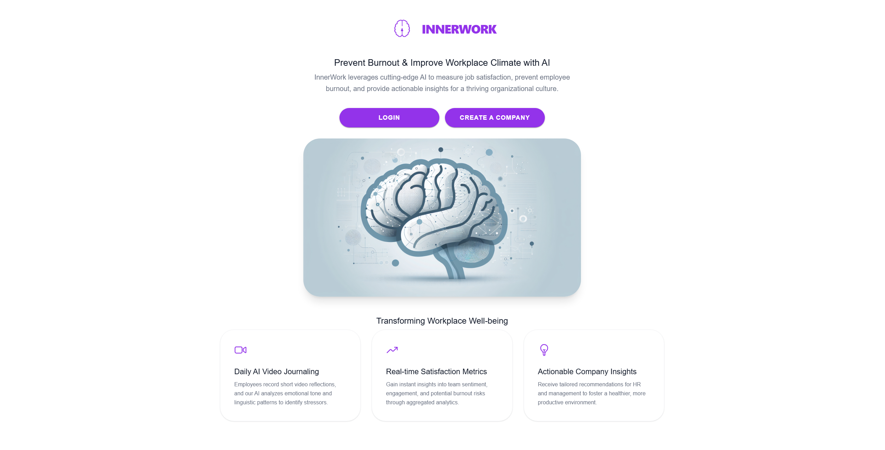
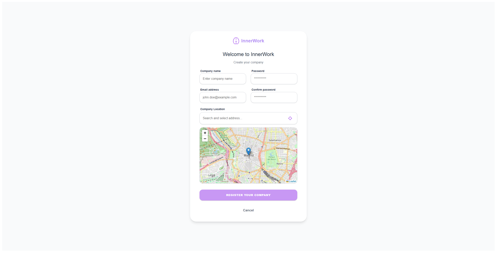
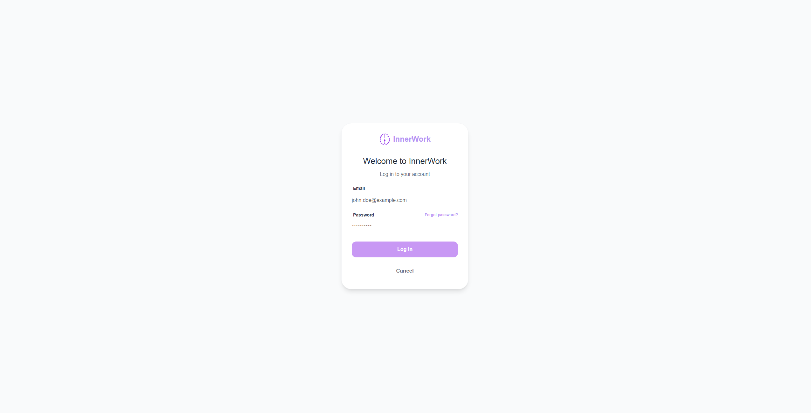
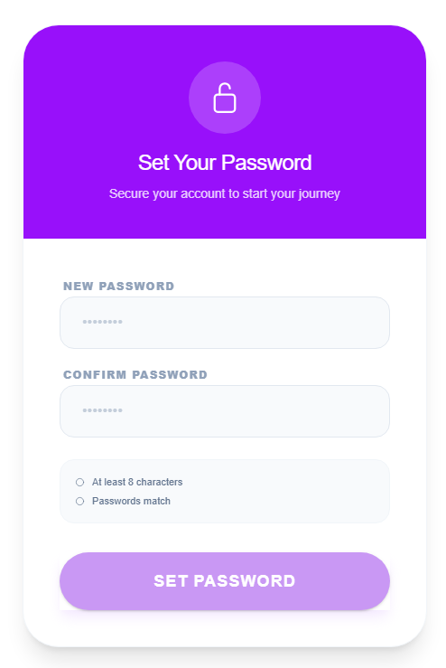
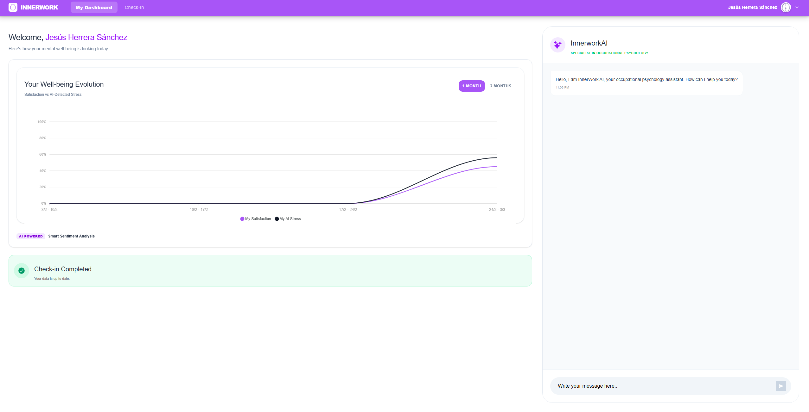
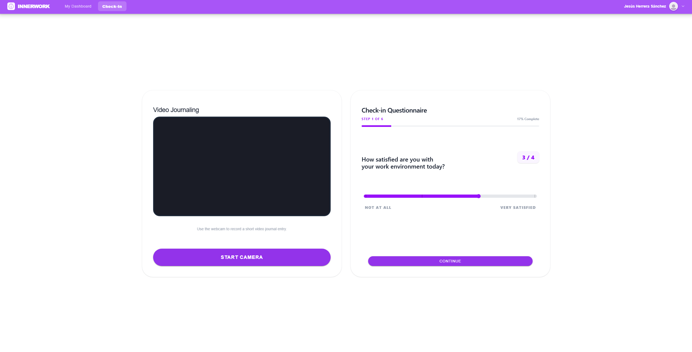
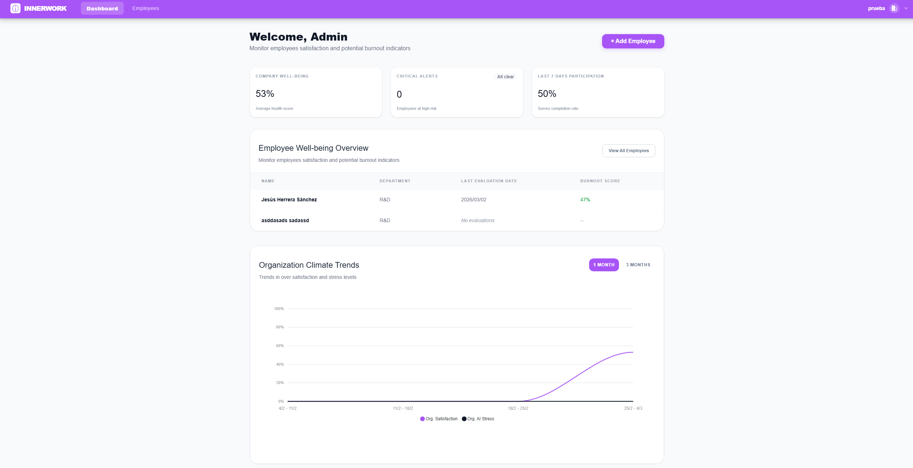
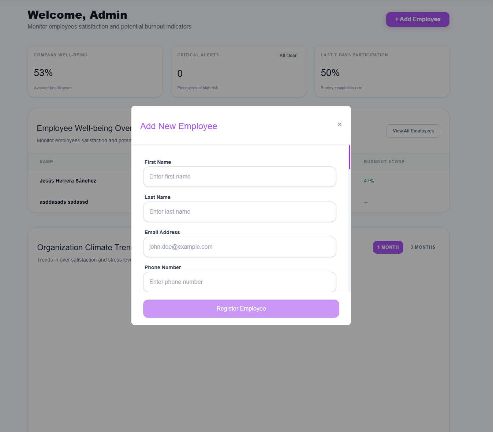
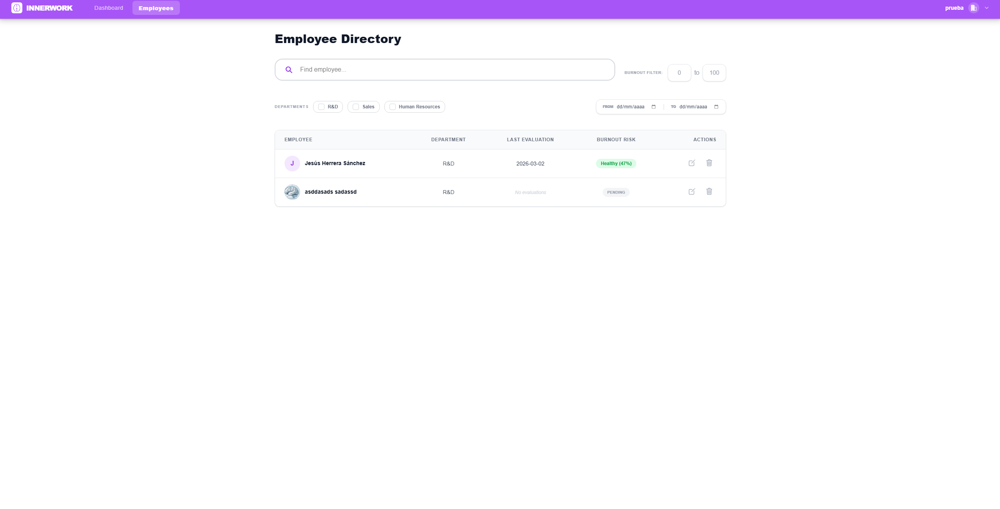

# InnerWork

## Autores
* [Antonio Delgado Rodríguez](https://github.com/AntonioDR01)
* [Alejandro Gálvez Madueño](https://github.com/AGALMAD)
* [Jesús Herrera Sánchez](https://github.com/Jesushs4)
* [Manuel Dueñas Cortés](https://github.com/manuelduenascortes)

## Justificación y descripción del proyecto
Este proyecto consiste en una aplicación web y móvil de Machine Learning, enfocada en el análisis de la satisfacción laboral de los empleados. Los usuarios completan encuestas periódicas que recopilan datos sobre su bienestar y experiencia en el trabajo. A partir de estas respuestas, el sistema procesa la información y genera métricas e indicadores de satisfacción. Cada empleado puede acceder a un dashboard personal para visualizar su evolución a lo largo del tiempo. Por otro lado, los administradores de cada empresa disponen de un panel global donde pueden analizar el estado de satisfacción de todos sus empleados. El objetivo principal es ayudar a las empresas a detectar problemas laborales y mejorar el clima organizacional. 

La idea surge de la necesidad de mejorar el ambiente laboral y poder evitar tanto el *burnout* como el malestar a la hora de trabajar, de forma que se puedan detectar patrones y poder tomar medidas al respecto.

## Aplicación web

### Landing Page

### Registro
* Registro para crear empresa

### Login
* Login para acceder tanto como admin como empleado

### Reiniciar contraseña / Verificar cuenta
* Página accesible mediante correo de reestablecer contraseña, funcional mediante token en la URL.

### Dashboard de empleados
* Gráfica enseñando el historial de satisfacción y de estrés del empleado
* Alerta de si hay un *check-in* pendiente
* Chatbot mediante la API de Groq, especializado en estrés laboral y *burnout*, con contexto del último formulario del empleado para poder ayudarle.

### Check-in
* Prueba de vídeo y audio donde se obtendran imágenes y audio durante mínimo 15 segundos para analizar estrés mediante IA.
* Formulario breve donde el empleado describe como le ha ido su semana laboral para analizarlo junto a sus datos de empleado mediante IA.

### Dashboard de admin
* Modal para crear empleado
* Tarjetas representando el estado de la empresa (Porcentaje de *burnout* general, alertas críticas y porcentaje de formularios realizados)
* Lista de empleados con su respectivo porcentaje de *burnout*
* Gráfica enseñando el historial de satisfacción y estrés de la empresa

### Lista de empleados
* Filtro para buscar empleados por nombre, nivel de *burnout*, departamento y por fecha del último formulario.
* Editar datos de empleados
* Borrar empleados

